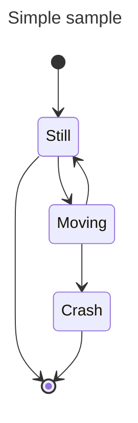

# Aprendiendo Markdown

Esto es texto normal y corriente escrito debajo del encabezado.

# Encabezado nivel 1
## Encabezado de nivel 2
### Encabezado de nivel 3
#### Encabezado de nivel 4
##### Encabezado de nivel 5
###### Encabezado de nivel 6

# Texto y saltos de línea
Este es un texto que está en 
la misma línea, aunque en el 
editor se escribe en líneas separadas.

Esto comienza en un párrafo nuevo
porque se han puesto dos saltos de línea.

Y esto está en líneas sepadas  
porque tras cada linea hay  
dos espacios y un salto de línea.

# Listas
## Listas no Ordenadas
* Elemento 1
* Otro elemento
* Más elementos
  * Elemento anidado
  * Anidado 2
    * Anidado 3 

## Listas Ordenadas
Estos son los puntos a seguir:

1. Leer la documentación
2. Practicar
3. Practicar más
4. Y seguir practicando más y más

## Listas de tareas
- [x] Estudiar markdown
- [x] Practicar con markdown
- [ ] Hacer la wiki

# Resaltado de texto
Ejemplo de *texto en cursiva*  
Ejemplo de **texto en negrita**

# Código
```
# -- Ejemplo de código en python
a = 2
print("Programa en python")
print(f"La variable a vale {a}")
```

* Si tras el los tres apóstrofos iniciales indicamos el lenguaje de programación usado, se realizará un resaltado de sintáxis básico. Así, como el código anterior es python, lo podríamos poner así:
```python
# -- Ejemplo de código en python
a = 2
print("Programa en python")
print(f"La variable a vale {a}")
```

* También podemos insertar código dentro de la línea, poniéndolo entre apóstrofos. En python la expresión `print(f" a + b = {2 + 1} ")` produce como resultado `a + b = 3`.

# Enlaces
Los enlaces a una página web externa se define utilizando esta notación: [Texto enlace](URL página). También podemos poner enlaces a cualquier encabezado definido en nuestro documento con esta sintáxis: [Texto enlace interno](#encabezado).

## Enlaces externos
En wikipedia encontramos más información sobre [markdown](https://es.wikipedia.org/wiki/Markdown).

## Enlaces internos
Aquí hay información sobre [los enlaces](#Enlaces) en markdwon.

# Imágenes
Las imágenes se introducen en el documento con la siguiente sintáxis:  donde imagen puede ser bien el nombre del fichero dentro de nuestro sistema de ficheros local o bien una URL de una imagen de internet.

## Imagen en fichero local


## Imagen en URL


# Citas 
Un par de citas de Isaac Asimov:

> Escribo por la misma razón por la que respiro, porque si no lo hiciera, moriría.

> Estoy convencido de que la autoeducación es el único tipo de educación que existe.

# Tablas
|         | Col 1 | Col 2| Col 3| Col4 |
|---------|-------|------|------|------|
|  Fila 1 |   1   |   2  |   3  |  4   |
|  Fila 2 |   2   |   4  |   6  |  8   |
|  Fila 3 |   3   |   6  |   9  |  12  |

* Esta es otra tabla que incluye texto y enlaces. Fijate que la cantidad de espacios usados no influye. Las celdas pueden estar descuadradas. Es el renderizador el que dibuja la tabla con el tamaño exacto:

|          |  node.js  | Django | Flask | Electron |
|----------|-----------|--------|-------|----------|
| Lenguaje | Js        | Python | Python| js       |
| URL      | [link](https://nodejs.org/es/) | [link](https://www.djangoproject.com/)  | [Link](https://flask.palletsprojects.com/en/1.1.x/) | [Link](https://www.electronjs.org/) |
| Versión  |  14.15.5  | 3.1.6  | 1.1.2 | 11.2.3 |

# Fórmulas matemáticas
* Las fórmulas se encuentra delimitadas por el carácter $:

    * Teorema de pitágoras: $h^2 = x^2 + y^2$
    * $\alpha=\beta + \gamma$

* Las llaves {} son caracteres especiales por lo que para que se rendericen bien hay que meter la fórmula usando el $ seguido del tick:

    $`T = \{\phi, \psi, \chi, \neg, \rightarrow, \left(, \right) \}`$

* Los subíndices se pueden porner a cualquier símbolo o letra utilizando el símbolo _.

    * Tenemos las variables $a_1$ y $a_2$

* Fracciones:

    * $F = G \left( \frac{m_1 m_2}{r^2} \right)$  

# Notas
La creamos con las siguientes marcas:

> **_NOTA:_**  Esta es una nota creada con markdown estándard.

Podemos añadir líneas horizontales para resaltar la nota más:

---
> **_NOTA:_**  
>  Esta es otra nota creada con markdown estándard

---

Sin embargo, el markdown de Github permite poner notas más vistosas:

> [!NOTE]  
> Esta es una nota del Markdown de Github

> [!TIP]
> Se usa para dar información adicional (Trucos)

> [!IMPORTANT]  
> Información importante!

> [!WARNING]  
> Información crítica que requiere una atención especial del usuario

> [!CAUTION]
> Precaución! Este comando puede borrar tu disco duro!

# Diagramas
Se pueden crear diagramas fácilmente utilizando la sintáxis de mermaid.

Unos ejemplos son:




# Ficheros 3D en STL
Es posible también mostrar objetos 3D que estén en formato STL (de texto). Este es el clásico ejemplo del cubo, que se obteiene con este código:

```stl
solid Mesh
  facet normal -1 0 0
    outer loop
      vertex 0 0 0
      vertex 0 0 10
      vertex 0 10 0
    endloop
  endfacet
  facet normal -1 0 0
    outer loop
      vertex 0 10 0
      vertex 0 0 10
      vertex 0 10 10
    endloop
  endfacet
  facet normal 1 0 0
    outer loop
      vertex 10 0 10
      vertex 10 0 0
      vertex 10 10 0
    endloop
  endfacet
  facet normal 1 -0 0
    outer loop
      vertex 10 0 10
      vertex 10 10 0
      vertex 10 10 10
    endloop
  endfacet
  facet normal 0 -1 0
    outer loop
      vertex 10 0 0
      vertex 10 0 10
      vertex 0 0 0
    endloop
  endfacet
  facet normal 0 -1 0
    outer loop
      vertex 0 0 0
      vertex 10 0 10
      vertex 0 0 10
    endloop
  endfacet
  facet normal 0 1 0
    outer loop
      vertex 10 10 10
      vertex 10 10 0
      vertex 0 10 0
    endloop
  endfacet
  facet normal 0 1 0
    outer loop
      vertex 10 10 10
      vertex 0 10 0
      vertex 0 10 10
    endloop
  endfacet
  facet normal 0 0 -1
    outer loop
      vertex 0 10 0
      vertex 10 10 0
      vertex 0 0 0
    endloop
  endfacet
  facet normal 0 0 -1
    outer loop
      vertex 0 0 0
      vertex 10 10 0
      vertex 10 0 0
    endloop
  endfacet
  facet normal 0 0 1
    outer loop
      vertex 10 10 10
      vertex 0 10 10
      vertex 0 0 10
    endloop
  endfacet
  facet normal 0 0 1
    outer loop
      vertex 10 10 10
      vertex 0 0 10
      vertex 10 0 10
    endloop
  endfacet
endsolid Mesh
```

# Código HTML
En los documentos markdown que se suben a github se pueden meter etiquetas HTML. Esto nos permite utilizar toda la potencia de este lenguaje para hacer páginas más bonitas, aunque se recomienda no abusar.

## Comentarios
Los comentarios en HTML nos permiten introducir información adicional en el Markdown, que NO SERÁ RENDERIZADA.

<!-- Esto es un comentario -->

Un uso muy frecuente de los comentarios es OCULTAR partes de nuestro documento markdown. Al colocar los comentarios el markdown situado en el interior se deshabilita, y esto nos permite ocultar texto temporalmente.

## Desplegado de información
La etiqueta "details" de HTML nos permite introducir información que se pliega/despliega. Lo vemos en este ejemplo:

## Más información
<details>
  <summary>Más información</summary>
  Esta información aparece al desplagarse....
</details>